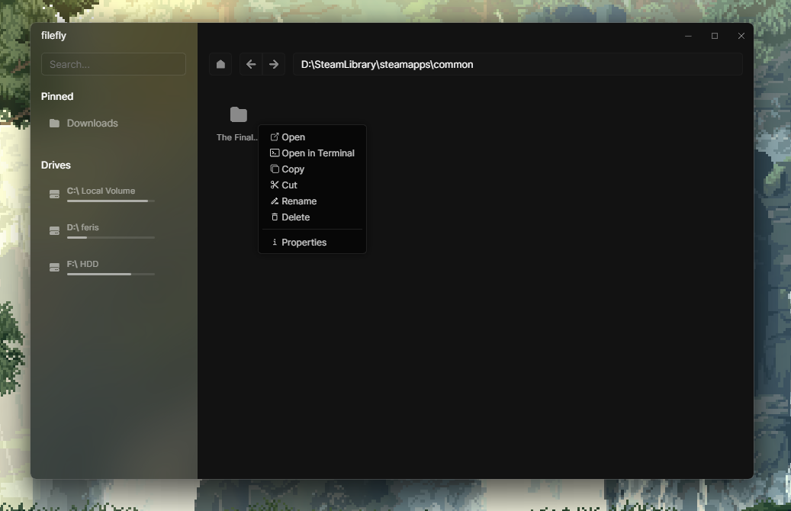
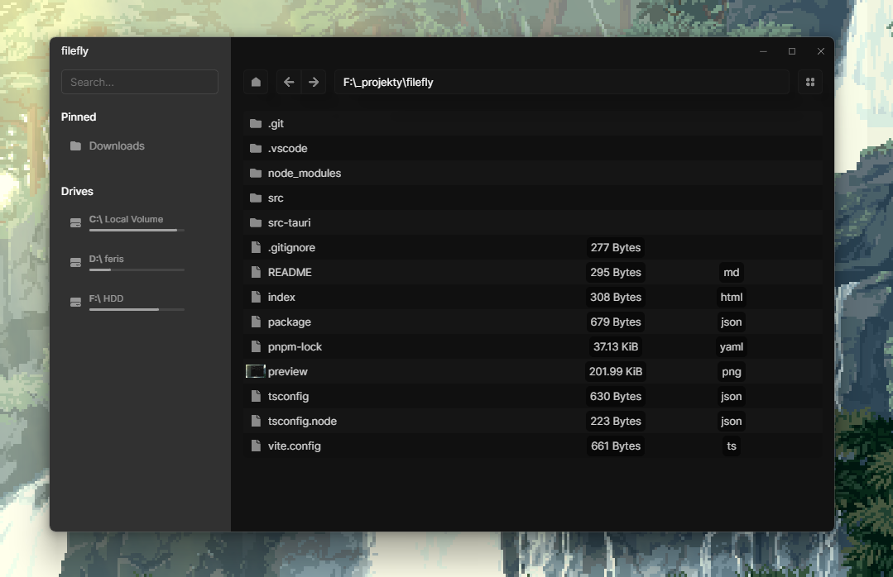

# Sito File Browser

Sito File Browser is a faster file explorer alternative.

## To-Do List

- [x] Implement main functions

  - [x] Open
  - [x] Open in terminal
  - [x] Copy
  - [x] Cut
  - [x] Delete
  - [x] Rename

- [ ] Make it work offline (font, icons, etc.)

- [x] Create a custom context menu (ensure functionality!)

- [x] Refactor code for cleaner structure

- [x] Fix file names (e.g., .gitignore)

- [x] Add audio file preview

- [ ] Add video file preview

- [x] Add image file preview

- [x] Add markdown file preview

- [ ] Manage favorite folders on the sidebar and make them functional

- [ ] Ensure the context bar is always visible (if there's not enough space)
